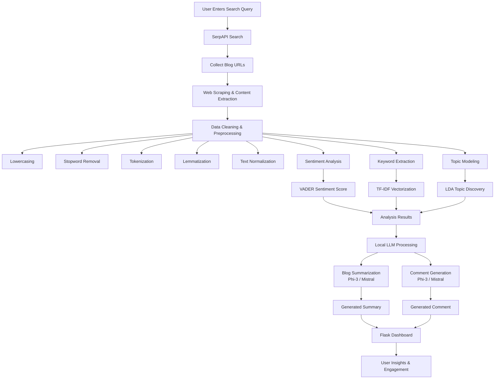

# Automated-Blog-Posting-Engagement-System
# 🧠 BlogMind AI

## AI-Powered Blog Intelligence & Engagement Automation Platform

BlogMind AI is an intelligent content analysis and engagement automation platform that leverages Natural Language Processing (NLP), Machine Learning, and Local Large Language Models (LLMs) to discover, analyze, summarize, and interact with blog content automatically.

The platform is designed to help users identify trending topics, understand audience sentiment, generate concise summaries, and create context-aware comments for improved engagement.

---

## 🚀 Project Overview

The rapid growth of online content makes it difficult to manually discover valuable blogs, analyze their content, and engage with audiences effectively.

BlogMind AI addresses this challenge by automating the entire workflow:

1. Discover relevant blogs from search engines.
2. Extract and process blog content.
3. Analyze sentiment and topics.
4. Generate AI-powered summaries.
5. Create human-like comments.
6. Present insights through an interactive web interface.

---

## ✨ Key Features

### 🔍 Automated Blog Discovery

* Retrieves blog URLs using SerpAPI.
* Searches blogs based on user-defined keywords.
* Collects content from multiple sources automatically.

### 📄 Blog Content Extraction

* Extracts textual content from discovered blogs.
* Removes irrelevant HTML elements.
* Cleans and structures extracted data.

### 🧹 Data Preprocessing

* Text normalization.
* Lowercasing.
* Stopword removal.
* Punctuation removal.
* Tokenization.
* Lemmatization.

### 😊 Sentiment Analysis

Uses VADER Sentiment Analyzer to classify content sentiment:

* Positive
* Neutral
* Negative

Provides sentiment scores for each blog article.

### 🔑 Keyword Extraction

Uses TF-IDF (Term Frequency-Inverse Document Frequency) to identify important keywords and phrases from blog content.

### 📚 Topic Modeling

Implements Latent Dirichlet Allocation (LDA) to:

* Discover hidden topics.
* Group related content.
* Identify trending discussions.

### 🤖 AI-Powered Blog Summarization

Utilizes local Large Language Models through Ollama:

* Phi-3
* Mistral

Generates concise summaries while preserving important information.

### 💬 Intelligent Comment Generation

Creates human-like comments based on blog content.

Capabilities include:

* Context awareness
* Relevant feedback generation
* Reader engagement support

### 📊 Interactive Dashboard

Built with Flask to provide:

* Blog analysis results
* Sentiment insights
* Topic visualization
* Generated summaries
* AI-generated comments

---

## 🏗️ System Architecture




---

## 🛠️ Technologies Used

### Programming Language

* Python

### Web Framework

* Flask

### Data Processing

* Pandas
* NumPy

### NLP Libraries

* NLTK
* VADER Sentiment Analyzer
* Scikit-learn

### Machine Learning Techniques

* TF-IDF Vectorization
* Latent Dirichlet Allocation (LDA)

### AI Models

* Phi-3
* Mistral

### LLM Runtime

* Ollama

### Data Collection

* SerpAPI
* BeautifulSoup
* Requests

### Frontend

* HTML
* CSS
* JavaScript

---

## 📁 Project Structure

```text
BlogMind-AI/
│
├── app.py
├── scraper.py
├── preprocessing.py
├── sentiment.py
├── keyword_extraction.py
├── topic_modeling.py
├── summarizer.py
├── comment_generator.py
|
├── templates/
│   ├── dashboard.html
│
├── static/
│   ├── style.css
│
├── data/
│   ├── blogs.csv
|
└── README.md
```

---

## 🤖 Install Ollama

Download and install Ollama:

https://ollama.com

Pull required models:

```bash
ollama pull phi3

ollama pull mistral
```

Verify installation:

```bash
ollama list
```

---

## ▶️ Running the Application

Start Flask server:

```bash
python app.py
```

Open browser:

```text
http://127.0.0.1:5000
```

---

## 📈 Workflow

1. User enters a search query.
2. SerpAPI retrieves relevant blogs.
3. Blog content is scraped and cleaned.
4. NLP analysis is performed:

   * Sentiment Analysis
   * Keyword Extraction
   * Topic Modeling
5. LLM generates:

   * Summary
   * Comment
6. Results are displayed on the dashboard.

---

## 🎯 Learning Outcomes

This project provided practical experience in:

* Natural Language Processing
* Text Mining
* Topic Modeling
* Sentiment Analysis
* Web Scraping
* Search Engine APIs
* Large Language Models
* Prompt Engineering
* Flask Development
* AI Application Deployment

---

## 🔮 Future Enhancements

* Multi-language support
* Real-time blog monitoring
* Advanced analytics dashboard
* Trend prediction system
* Social media integration
* Cloud deployment
* User authentication
* Database integration
* Multi-model comparison
* AI-powered recommendation engine

---

## ⚠️ Disclaimer

This project was developed for educational and research purposes. Generated summaries and comments should be reviewed before use in production environments.

---

## 👨‍💻 Authors

**Muhammad Ashir Iqbal**

